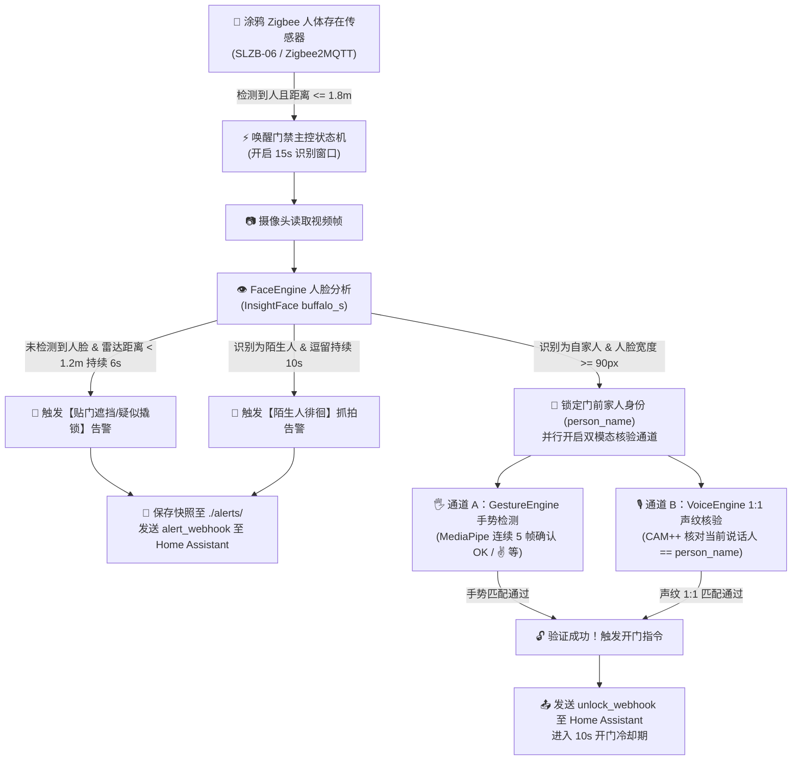

# 🏠 myHome — 全屋智能 AI 双模态门禁与主动安防系统

基于 **Mac 宿主机 (CoreML 硬件加速) + UTM Home Assistant + SLZB-06 (Zigbee2MQTT)** 打造的本地化全屋智能门禁与门厅主动安防守护服务。

系统通过门厅 **涂鸦 Zigbee 毫米波人体存在传感器** 实现毫秒级低功耗按需唤醒，在识别到自家人立于门前时，同步开启 **【人脸 + 手势】** 与 **【人脸 + 声纹】** 双通道跨模态防伪核验，任一通道验证通过即刻通过 Webhook 驱动 Home Assistant 解锁智能门锁；同时具备 **陌生人超时逗留抓拍** 与 **贴门蒙面/遮挡防撬告警** 能力。

---

## ✨ 核心特性

- **📡 毫米波雷达按需唤醒（低功耗待机）**
  - 订阅 `SLZB-06 / Zigbee2MQTT` 的涂鸦人体存在传感器事件（`presence` & `target_distance`）。
  - 无人或距离大于设定阈值（默认 `1.8m`）时系统处于低功耗休眠；有人走近门前自动唤醒视觉与声纹引擎，持续监测设定的时间窗口（默认 `15s`）。
- **👁️ 1:N 家人识别与远近过滤（InsightFace）**
  - 采用 `SCRFD + ArcFace (buffalo_s)` 模型，在 macOS 下优先启用 `CoreMLExecutionProvider` 硬件加速。
  - 支持**单张生活照极速入库**或**同一人多张照片自动特征融合（L2 均值归一化）**。
  - 内置最小人脸像素宽度过滤（默认 `90px`），走廊远处路过不误触发开门流程。
- **🔓 双通道跨模态无感/交互开门（防照片、防外人录音攻击）**
  - **通道 A【人脸 + 手势】**：基于 `MediaPipe Hands` 21 个 3D 骨骼关键点几何关系的零训练手势引擎，支持 `OK`、`VICTORY` (✌️)、`OPEN_PALM` (🖐️)、`THUMB_UP` (👍)，具备多帧连续防抖确认（默认 `5` 帧）及**家人专属手势暗号绑定**。
  - **通道 B【人脸 + 声纹】**：基于阿里达摩院 `3D-Speaker (CAM++)` 中文声纹模型（`sherpa-onnx`），采用**跨模态 1:1 强绑定核验**——以视觉锁定的人脸 ID 作为前置锚点，仅比对麦克风实时语音是否属于当前站在镜头前的那位家人，并内置 RMS 语音能量阈值过滤环境底噪。
- **🚨 主动安防双规则告警**
  - **规则 1（陌生人徘徊告警）**：画面出现未入库陌生人且在门厅连续逗留超过阈值（默认 `10s`），自动抓拍高清现场照保存至 `./alerts/` 并推送 Home Assistant 高危告警。
  - **规则 2（贴门遮挡/防撬告警）**：毫米波雷达检测到门前极近距离（`< 1.2m`）有人，但摄像头连续多秒（默认 `6s`）检测不到任何人脸（如恶意遮挡镜头、蒙面或低头撬锁），立即抓拍并触发告警。
- **🔥 热重载与本地演示模式**
  - 内置 `test_mode` 调试窗口，支持键盘快捷键一键模拟传感器触发、实时预览骨骼与人脸框，以及**不重启服务热重载**人脸与声纹底库。

---

## 🔄 系统工作流架构



---

## 📂 目录结构

```text
myHome/
├── main.py                 # 门禁总控状态机与主程序入口 (SmartDoorController)
├── config.yaml             # 系统全局配置（HA/MQTT、视觉参数、手势规则、声纹参数）
├── ha_connector.py         # Home Assistant Webhook 上行与 Zigbee2MQTT 下行通信器
├── requirements.txt        # Python 依赖包清单
├── vision/                 # 视觉子系统
│   ├── __init__.py
│   ├── face_engine.py      # InsightFace 人脸检测、1:N 家人识别与徘徊/遮挡安防监测
│   ├── gesture_engine.py   # MediaPipe Hands 21点零训练手势识别与防抖引擎
│   └── db/
│       └── faces/          # 家人正脸生活照底库（如: 爸爸.jpg, 妈妈_1.jpg）
├── audio/                  # 音频声纹子系统
│   ├── __init__.py
│   ├── voice_engine.py     # 3D-Speaker CAM++ 声纹特征提取与跨模态 1:1 核验引擎
│   ├── models/             # 存放 CAM++ ONNX 预训练模型文件
│   └── db/
│       └── voices/         # 家人 16kHz 单声道 WAV 语音底库（如: 爸爸.wav）
└── alerts/                 # 可疑人员徘徊/遮挡告警自动抓拍存档目录（运行时自动生成）
```

---

## 🚀 快速开始

### 1. 环境准备（支持零额外 `pip` 依赖直接加载开源 `.onnx` 权重）

本项目优先使用 **OpenCV (`cv2.FaceDetectorYN` + `cv2.FaceRecognizerSF`) 原生加载开源 ONNX 模型权重**，无需编译安装 `insightface` 或 `onnxruntime`，只需系统中已有 `opencv-python` 与 `numpy`（例如本机 `/opt/homebrew/bin/python3.11`）即可直接运行：

- **YuNet 人脸检测 + 5点关键点权重**：[face_detection_yunet_2023mar.onnx](file:///Users/a58/work/code/myHome/vision/models/face_detection_yunet_2023mar.onnx) (`227 KB`)
- **SFace 人脸特征提取权重**：[face_recognition_sface_2021dec.onnx](file:///Users/a58/work/code/myHome/vision/models/face_recognition_sface_2021dec.onnx) (`36.9 MB`)

> **人脸识别单独测试（静态图核验 + 摄像头实时比对）**：
> ```bash
> /opt/homebrew/bin/python3.11 test_face.py
> ```

若需启用完整的多模态手势与声纹功能，也可在虚拟环境中安装完整依赖：

```bash
python3 -m venv .venv
source .venv/bin/activate
pip install -r requirements.txt
```

### 2. 下载 3D-Speaker CAM++ 中文声纹模型

运行以下一键命令，将阿里达摩院 `CAM++` 中文预训练 ONNX 模型下载至 `./audio/models/` 目录：

```bash
mkdir -p ./audio/models
curl -L -o ./audio/models/3dspeaker_speech_campplus_sv_zh-cn_16k-common.onnx \
  https://github.com/k2-fsa/sherpa-onnx/releases/download/speaker-recongition-models/3dspeaker_speech_campplus_sv_zh-cn_16k-common.onnx
```

### 3. 录入家人底库（照片与声纹）

系统采用**零代码文件名自动归档机制**，人名以前缀（`_` 下划线之前的部分）为准，且视觉库与声纹库的人名必须保持一致：

#### 📸 录入人脸照片（放入 `./vision/db/faces/`）
- 支持格式：`.jpg`、`.jpeg`、`.png`、`.webp`
- **单张入库**：直接命名为 `爸爸.jpg`、`妈妈.jpg`
- **多张融合入库（推荐）**：命名为 `爸爸_1.jpg`、`爸爸_2.jpg`、`爸爸_戴眼镜.jpg`，系统会自动提取每张照片最大人脸特征并求均值归一化，大幅提升不同光照角度下的识别率。

#### 🎙️ 录入声纹样本（放入 `./audio/db/voices/`）
- 格式要求：**16kHz 采样率、单声道 (Mono)、16-bit PCM `.wav` 文件**（建议时长 3~5 秒，正常语速说一句日常开门口令，如“芝麻开门”或“我回来了”）。
- **命名规则**：与照片人名严格对应，例如 `爸爸.wav` 或多条融合 `爸爸_1.wav`、`爸爸_2.wav`。
- 如需使用 `ffmpeg` 转换手机录音文件（如 `.m4a` / `.mp3`）为标准 16kHz 单声道 WAV，可执行：
  ```bash
  ffmpeg -i input.m4a -ar 16000 -ac 1 -sample_fmt s16 ./audio/db/voices/爸爸.wav
  ```

### 4. 启动服务与交互热键

```bash
python main.py
```

当 `config.yaml` 中 `system.test_mode: true` 时，会弹出实时 AI 监测画面窗口，支持以下键盘操作：

| 按键 | 功能说明 |
| :--- | :--- |
| **`Space` (空格键)** | 模拟门厅涂鸦 Zigbee 传感器检测到有人进入（距离 `1.0m`），重置 `15s` 唤醒窗口 |
| **`R` 键** | **热重载底库**：无需重启程序，实时重新扫描 `./vision/db/faces` 和 `./audio/db/voices` |
| **`Q` 键** | 安全退出程序并释放摄像头资源 |

---

## ⚙️ 配置文件说明 (`config.yaml`)

核心配置项一览（完整注释请查看 [config.yaml](file:///Users/a58/work/code/myHome/config.yaml)）：

| 配置路径 | 默认值 | 说明 |
| :--- | :--- | :--- |
| `system.test_mode` | `true` | 本地调试模式（开启 GUI 预览窗口与键盘模拟触发；无头部署可设为 `false`） |
| `system.active_window_sec` | `15` | 涂鸦传感器触发后，摄像头与声纹保持激活的最大窗口时间（秒） |
| `system.unlock_cooldown_sec` | `10` | 开门成功后的冷却时间（秒），防止刚开门时重复发送 Webhook |
| `home_assistant.base_url` | `http://homeassistant.local:8123` | Home Assistant 实例地址 |
| `home_assistant.mqtt.enabled` | `false` | 是否开启 MQTT 实时监听 `Zigbee2MQTT` 传感器主题（正式环境设为 `true`） |
| `home_assistant.mqtt.trigger_distance_max_m` | `1.8` | 毫米波雷达触发唤醒的最大距离阈值（米） |
| `vision.camera_source` | `0` | 视频源：`0` 为 Mac 内置摄像头，正式环境填门口 IPC 的 `rtsp://...` 地址 |
| `vision.face.similarity_threshold` | `0.45` | InsightFace 人脸余弦相似度阈值（`> 0.45` 判定为同一人） |
| `vision.face.min_face_width_px` | `90` | 触发开门认证的最小人脸框像素宽度（过滤远处走廊路过） |
| `vision.face.stranger_loiter_alert_sec` | `10.0` | 陌生人在门厅连续逗留触发抓拍报警的时长（秒） |
| `vision.face.no_face_occlusion_alert_sec` | `6.0` | 雷达显示门前 `<1.2m` 有人但画面无脸触发防遮挡报警的时长（秒） |
| `vision.gesture.unlock_gestures` | `["OK", "VICTORY"]` | 全局允许触发开门的手势列表（可选：`OK`, `VICTORY`, `OPEN_PALM`, `THUMB_UP`） |
| `vision.gesture.confirm_frames` | `5` | 手势防抖确认帧数（需连续检测到相同手势才触发） |
| `vision.gesture.person_gesture_map` | `{}` | 家人专属手势绑定（如 `{"爸爸": "OK", "妈妈": "VICTORY"}`，留空则全员通用） |
| `audio.similarity_threshold` | `0.60` | CAM++ 声纹 1:1 跨模态余弦相似度阈值 |
| `audio.vad_energy_threshold` | `0.015` | 触发声纹比对的最小语音 RMS 能量阈值（过滤静音与环境白噪音） |

---

## 🔗 Home Assistant 与 Zigbee2MQTT 联动指南

### 1. Zigbee2MQTT 传感器消息格式兼容
[ha_connector.py](file:///Users/a58/work/code/myHome/ha_connector.py) 自动兼容主流涂鸦 Zigbee 24GHz/5.8GHz 人体存在传感器的 JSON 载荷字段：
- **存在状态字段**：支持 `presence: true/false` 或 `occupancy: true/false`
- **目标距离字段**：支持 `target_distance: 1.25` 或 `distance: 1.25`（单位：米）

### 2. Home Assistant Webhook 自动化配置示例

在 Home Assistant 的 `automations.yaml` 中添加以下两个 Webhook 触发器，即可无缝接收开门与安防告警事件：

```yaml
# 自动化 1：接收 AI 双模态验证通过指令 -> 打开智能门锁并播报欢迎语
- alias: "AI 双模态门禁自动开门"
  trigger:
    - platform: webhook
      webhook_id: ai_door_unlock_event
      allowed_methods:
        - POST
      local_only: true
  action:
    - service: lock.unlock
      target:
        entity_id: lock.smart_front_door
    - service: notify.mobile_app_iphone
      data:
        title: "🔓 家门已解锁"
        message: >
          欢迎 {{ trigger.json.person }} 回家！
          验证方式：{{ trigger.json.auth_mode }} ({{ trigger.json.detail }}，人脸得分：{{ trigger.json.face_score }})

# 自动化 2：接收门厅可疑人员徘徊/遮挡告警 -> 推送手机强提醒
- alias: "AI 门厅可疑人员高危告警"
  trigger:
    - platform: webhook
      webhook_id: ai_suspicious_alert_event
      allowed_methods:
        - POST
      local_only: true
  action:
    - service: notify.mobile_app_iphone
      data:
        title: "🚨 门厅安防高危告警"
        message: >
          原因：{{ trigger.json.reason }}
          抓拍路径：{{ trigger.json.snapshot_path }}
```
