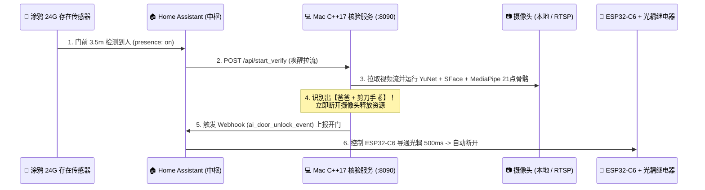

# 🛡️ myHome — 全屋智能 C++17 高性能双模态门禁核验系统

基于 **Mac C++17 原生推理服务 + Home Assistant (SLZB-06 / 涂鸦 24G 毫米波雷达) + ESP32-C6 光耦继电器** 构建的超低延迟智能门禁核验系统。

---

## ✨ 核心架构亮点

- **⚡ 纯 C++17 原生算力核验服务 (`myhome_verify_server`)**
  - **0% CPU 深度休眠待机**：平时不连接摄像头、不拉取视频流，内存占用仅 `~15 MB`。
  - **毫米波雷达 3.5 米提前预热拉流**：由 Home Assistant 监听门厅 **涂鸦 Zigbee 24G 毫米波人体存在传感器**，当人进入走廊 3.5 米范围时立即通过 HTTP 接口唤醒 C++ 服务提前建流，消除 RTSP 冷启动延迟。
  - **单帧 ~10ms 极速视觉与手势推理**：基于 OpenCV 4.13 C++ 原生 `cv::FaceDetectorYN (YuNet)` + `cv::FaceRecognizerSF (SFace)` + `cv::dnn::Net (MediaPipe 21点 3D 手部骨骼)`，无需 Python 与 GIL 锁开销。
  - **认出即关流（提前释放资源）**：一旦识别出 **【门前家人 (`>=90px`) + 开门手势 (`OK` 👌 / `VICTORY` ✌️ / `OPEN_PALM` 🖐️ / `THUMB_UP` 👍)】**，毫秒级返回结果并立即断开摄像头回到休眠态。
- **🖥️ 内置可视化 Web 测试控制台 (`http://127.0.0.1:8090`)**
  - C++ 服务自带 HTTP 与实时 MJPEG/JPEG 视频帧流，打开浏览器即可一键模拟传感器唤醒、实时查看人脸框与 21 点手部骨骼画面、以及观察 **ESP32-C6 + 光耦 (PC817) 500ms 点动脉冲** 状态。

---

## 🔄 全链路闭环工作流



---

## 📂 目录结构

```text
myHome/
├── config.yaml                     # 全局配置文件（HA 地址、模型路径、识别阈值）
├── web/
│   └── index.html                  # 可视化 Web 测试与实时监控控制台 (http://127.0.0.1:8090)
├── cpp_service/                    # C++17 高性能核验服务源码
│   ├── CMakeLists.txt              # CMake 构建配置 (OpenCV 4.13 + yaml-cpp + nlohmann_json + libcurl)
│   ├── include/
│   │   ├── face_engine.hpp         # C++ YuNet + SFace 人脸检测与多图均值特征融合引擎
│   │   └── gesture_engine.hpp      # C++ MediaPipe 21点手部骨骼与零训练手势分类器
│   └── src/
│       ├── main.cpp                # 按需拉流调度器与内置 HTTP/Web 服务 (:8090)
│       ├── face_engine.cpp
│       └── gesture_engine.cpp
└── vision/
    ├── models/                     # 开源 ONNX 模型权重 (已加入 .gitignore)
    │   ├── face_detection_yunet_2023mar.onnx
    │   ├── face_recognition_sface_2021dec.onnx
    │   ├── palm_detection_mediapipe_2023feb.onnx
    │   └── handpose_estimation_mediapipe_2023feb.onnx
    └── db/faces/                   # 家人正脸底库照片 (如: 爸爸_1.jpg, 爸爸_2.jpg)
```

---

## 🚀 编译与运行指南

### 1. 编译 C++17 服务
```bash
cmake -S cpp_service -B cpp_service/build
make -C cpp_service/build -j8
```

### 2. 启动服务与 Web 控制台
```bash
./cpp_service/build/myhome_verify_server
```
启动后在浏览器访问：👉 **[http://127.0.0.1:8090](http://127.0.0.1:8090)**

### 3. 核心 HTTP API 接口一览
| 接口路径 | 方法 | 说明 |
| :--- | :---: | :--- |
| `/` | `GET` | 打开可视化 Web 测试与实时视频流控制台 |
| `/api/start_verify` | `POST` | **异步唤醒拉流核验**（供 Home Assistant 涂鸦 24G 传感器自动化调用，自带防重入去重） |
| `/api/verify` | `POST` | **同步阻塞拉流核验**（识别通过或超时后直接返回 JSON 核验结果） |
| `/api/stop_verify` | `POST` | 立即提前终止当前拉流并释放摄像头 |
| `/api/test_relay` | `POST` | 模拟触发一次 **ESP32-C6 光耦继电器 500ms 点动脉冲** 与 HA Webhook |
| `/api/reload` | `POST` | 不停机热重载 `./vision/db/faces/` 下的家人照片底库 |
| `/api/status` | `GET` | 获取服务实时状态（`IDLE_SLEEP` / `VERIFYING_STREAM`）、当前锁定人物与历史开门记录 |
